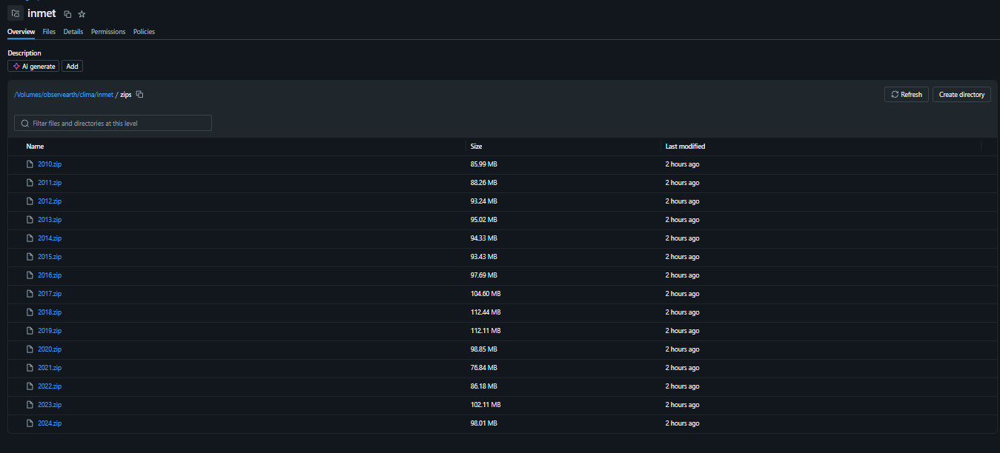
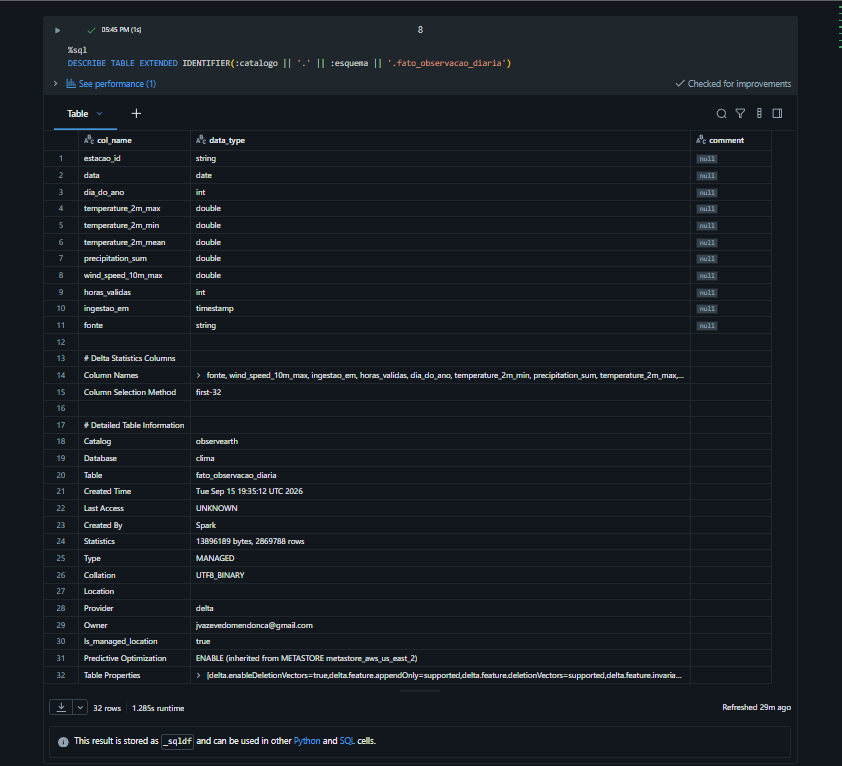
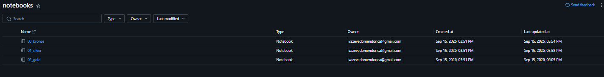
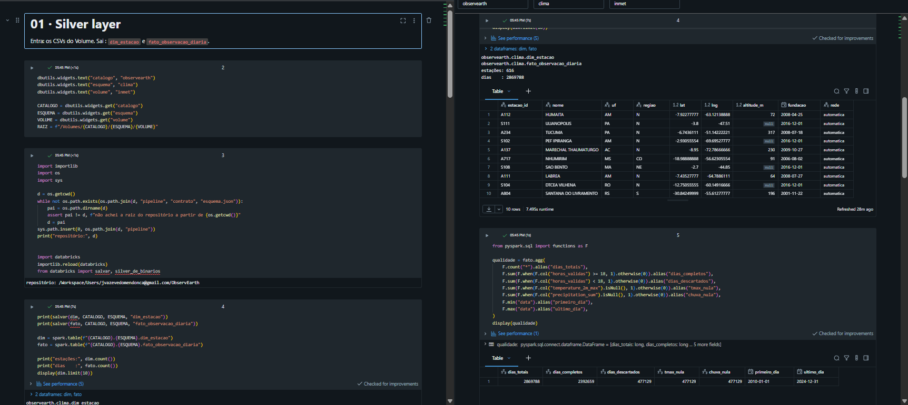
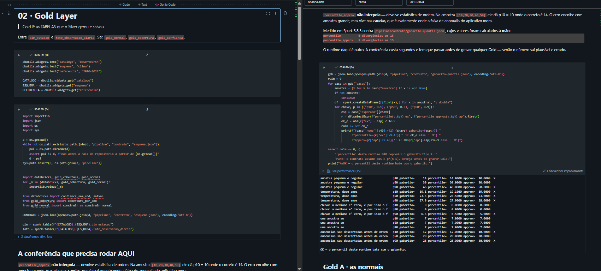
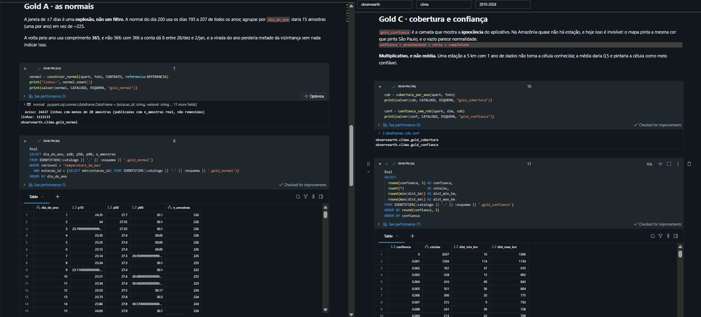
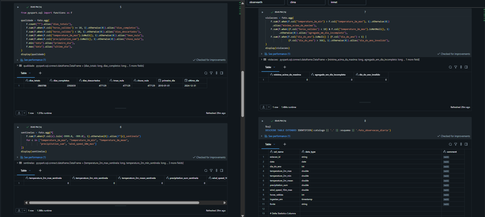
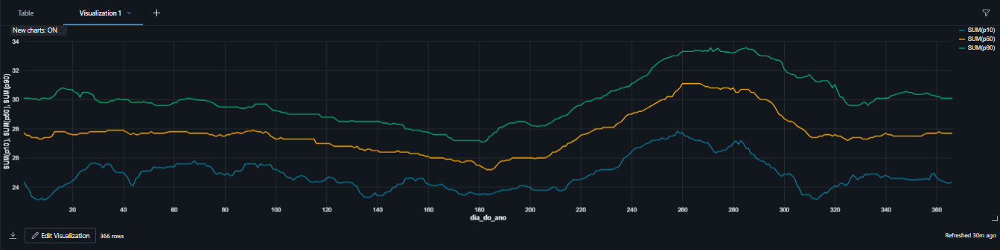
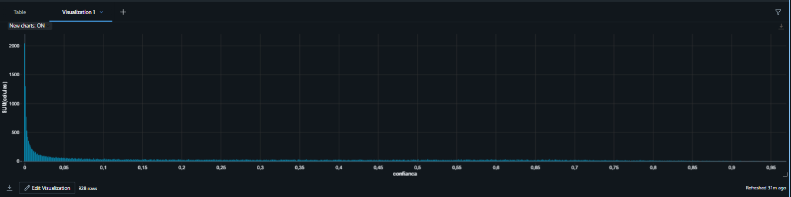

# MVP — Pipeline de Dados na Nuvem

**ObservEarth · Patch MVP**
João Victor · Repositório: `ObservEarth` · Documento: `docs/MVP.md`

---

## Como ler este documento

Ele descreve um subsistema de dados em lote construído **dentro** do ObservEarth, não ao lado dele. O projeto tinha um subsistema de tempo real maduro (globo 3D, campos GFS, sonda climatológica) e um subsistema de lote embrionário — `pipeline/era5_download.py` e `pipeline/ingest_open_data.py`, que rodavam na máquina local, sem camadas, sem catálogo e sem teste. O MVP é esse segundo subsistema saindo do embrião.

**Convenção de honestidade.** Todo número neste documento é medido ou é marcado como pendente. Onde aparecer

> ⟨PENDENTE — execução real⟩

é porque a contagem só existe depois de rodar sobre os dados completos, e preencher com estimativa seria exatamente o defeito que o pipeline inteiro foi desenhado para impedir. O §7 lista tudo que está nesse estado.

**A execução completa foi feita em 15/09/2026**, no Databricks serverless, sobre 2010–2024: 7.955 arquivos, 616 estações, 2.869.788 dias. Os números de §5.3, §6.1 e §6.4 são dessa execução. O que continua marcado é o **M4** (§6.3), cujo pareamento com o ERA5 não rodou — e por isso não há número de viés aqui.

---

## 1. Contexto de Negócios e Perguntas

### 1.1 O contexto

O ObservEarth mostra o estado da atmosfera agora: vento, pressão, temperatura, focos de calor, qualidade do ar. Ele responde bem *"o que está acontecendo"* e não responde nada de *"isso é muito?"*.

A diferença não é cosmética. 31 °C em Manaus em janeiro é um dia comum; 31 °C em Curitiba em julho é um evento. Sem uma referência histórica por lugar e por dia do ano, o aplicativo mostra números e deixa a interpretação inteira com quem olha — e quem olha, em geral, não tem essa referência na cabeça.

A camada climatológica que já existe no app resolve isso **por ponto arbitrário**, via reanálise ERA5 (Open-Meteo Archive), uma requisição por clique. Ela é boa e tem dois limites: depende de rede a cada consulta, e é **modelo**, não observação. Nenhum termômetro do INMET entra nela.

O subsistema de lote existe para cobrir esses dois limites: processar em lote a série observada das estações automáticas brasileiras, uma vez, e servir tabelas prontas.

### 1.2 As perguntas

| # | Pergunta | Responde em |
|---|---|---|
| Q1 | Para cada estação e cada dia do ano, qual é a faixa esperada (p10, p50, p90) de máxima, mínima, média, chuva e vento? | §6.1 · `gold_normal` |
| Q2 | Quantos dias do último ano ficaram **fora** dessa faixa, e isso se concentra em alguma região? | §6.2 |
| Q3 | O modelo global (ERA5) erra sistematicamente contra o termômetro? Em que meses, em que regiões, e **quanto desse erro é só altitude**? | §6.3 · `gold_vies` |
| Q4 | Sobre que parte do território o aplicativo **não tem base observacional** para afirmar nada? | §6.4 · `gold_confianca` |

Q3 é a pergunta de maior valor e maior risco: ela produz uma afirmação **sobre a confiabilidade de todas as outras afirmações** que o app faz. Q4 é a mais barata e a que mais muda o produto, porque transforma ignorância em camada visível.

### 1.3 Origem dos dados e discussão de licença

**INMET — estações automáticas.** ZIPs anuais em `portal.inmet.gov.br/uploads/dadoshistoricos/{ANO}.zip`, um CSV horário por estação.

A licença **não é explícita**. O portal de download não declara CC-BY nem equivalente. O regime aplicável é o de dados públicos produzidos por órgão federal — Lei de Acesso à Informação (Lei 12.527/2011) e a política de dados abertos (Decreto 8.777/2016) — com atribuição à fonte. **Isto é uma leitura, não uma licença declarada, e está registrado como ambiguidade em vez de resolvido por conveniência.** A mitigação adotada: atribuição explícita ao INMET em `ATTRIBUTION.md` e no rodapé do aplicativo, e uso restrito a fins acadêmicos e de pesquisa neste trabalho.

**ERA5 via Open-Meteo Archive** (para Q3): dados da reanálise ERA5 do ECMWF/Copernicus, redistribuídos pela Open-Meteo sob licença aberta, com atribuição.

**NOAA CPC — Índice Oceânico Niño** (contexto de Q2): domínio público.

Nenhuma chave de API aparece neste repositório. As que o aplicativo usa moram em `.env`, fora do controle de versão.

---

## 2. Carga dos Dados

### 2.1 O que foi medido antes de escrever qualquer código

Medição em **08/09/2026**, com `tools/medir-fontes.mjs` — um script versionado no repositório, para que a medição seja refazível e não uma afirmação de memória.

| Verificação | Resultado |
|---|---|
| Padrão de URL dos ZIPs anuais | **Confirmado**, HTTP 200, `application/zip` |
| Tamanho — 2024 | 98,01 MB |
| Tamanho — 2020 | 98,85 MB |
| Tamanho — 2010 | 85,99 MB |
| Tamanho — **2000** | **0,50 MB** |
| Estações no ZIP de 2024 | **565** CSVs |
| Codificação | **LATIN-1** |
| Separador · decimal | `;` · **vírgula** |
| Estrutura | 8 linhas de metadados, cabeçalho na 9, dado a partir da 10 |
| Colunas | 20 — a **última é vazia** (toda linha termina em `;`) |
| Linhas de dado em 2024 | 8.784 = 366 × 24 |
| Sentinela de ausência | **Campo vazio.** `-9999` não aparece nenhuma vez |

### 2.2 A decisão de recorte, e ela veio do dado

O ZIP de 2000 tem **1/180** do volume do de 2010. A rede automática praticamente não existia no começo da série: puxar desde 2000 alongaria o período no papel sem adensar a amostra.

**Recorte adotado: 2010–2024.** Quinze anos, ~1,3 GB de ZIP bruto na camada Bronze.

E a consequência, registrada porque é incômoda: **quinze anos não é uma normal climatológica.** A OMM exige trinta. As tabelas geradas saem com `referencia: "2010-2024"`, e a interface é obrigada a dizer isso — ver §3.3 e §7.

### 2.3 Restrições do ambiente

| # | Restrição | Consequência |
|---|---|---|
| R1 | Databricks Free Edition restringe internet de saída a domínios confiáveis | `requests.get()` para o INMET pode falhar dentro do notebook |
| R2 | A verificação por LinkedIn **não** liberou a saída | **Medido**: `RemoteDisconnected` nas 15 tentativas de baixar do `portal.inmet.gov.br`. A carga foi upload manual dos ZIPs para um Volume do Unity Catalog |
| R3 | Serverless-only, 1 SQL warehouse `2X-Small` | Jobs em série, sem cluster customizado |
| R4 | Sem R e sem Scala | PySpark e SQL — já era o plano |
| R5 | Sem custom workspace storage | O caminho é **Volumes do Unity Catalog** |
| R6 | Serverless **não expõe `sparkContext`** | Sem `parallelize`, sem `broadcast`, sem RDD. Ver §4.1 |
| R7 | Serverless **não tem `cache()`** | `PERSIST TABLE is not supported on serverless compute`. A materialização é a tabela, e a checagem de qualidade roda depois da gravação |
| R9 | Orçamento próprio: máximo ¼ do free tier de qualquer API | O pareamento com ERA5 gasta ~600 chamadas **uma vez**: cabe |

R6 e R7 têm a mesma raiz: o serverless não expõe o que depende de executor
fixo. R6 foi previsto no desenho; **R7 foi encontrado batendo**, no meio da
execução, e está aqui pelo mesmo motivo que R2 — restrição medida vale mais que
restrição suposta.

### 2.4 Como a carga roda

```
node tools/medir-fontes.mjs --inmet 2024      # baixa, extrai uma estação, mede o formato
python pipeline/silver_inmet.py --entrada 'data/bronze/2024/*.CSV' --saida data/silver
```

A camada Bronze é o ZIP baixado e descompactado, **sem transformação nenhuma** — é a definição de Bronze, e é o que permite reprocessar sem baixar de novo. `data/bronze/` está no `.gitignore`: são 90 MB por ano, e repositório não é cache.



*`/Volumes/observearth/clima/inmet/zips` — os 15 ZIPs, de 76,8 MB (2021) a 112,4 MB (2018). O upload manual é consequência direta de R2.*

---

## 3. Modelagem e Catálogo de Dados

O catálogo é executável. Ele mora em `pipeline/contrato/esquema.json` (legível por máquina), `pipeline/contrato/esquema.md` (legível por gente) e `pipeline/contrato/validar.mjs` (o validador). O teste `test/contrato.mjs` roda dentro de `npm test`.

### 3.1 A regra de nomes

**Chave técnica em inglês, rótulo em português.** As chaves são as que o aplicativo já fala, herdadas da Open-Meteo; os nomes em português vivem no campo `rotulo`.

Isso não é anglicismo por preguiça: é o que faz o Parquet cair direto nas estruturas do app sem tradutor. Tradutor entre esquemas é onde nasce discordância silenciosa entre o que o rótulo diz e o que o número é. Há um teste que reprova qualquer campo com nome de grandeza em português — um `temperatura_maxima` no contrato seria o adaptador nascendo.

### 3.2 As tabelas

| Tabela | Camada | Chave | Papel |
|---|---|---|---|
| `dim_estacao` | silver | `estacao_id` | dimensão: onde a estação está, desde quando, que rede |
| `fato_observacao_diaria` | silver | `estacao_id` + `data` | fato: o dia agregado, com completude |
| `gold_normal` | gold | `estacao_id` + `variavel` + `dia_do_ano` | os percentis por dia do ano |
| `gold_vies` | gold | `estacao_id` + `modelo` + `variavel` + `mes` | modelo − observação, por mês |
| `gold_cobertura` | gold | `estacao_id` + `ano` | dias medidos vs esperados |
| `gold_confianca` | gold | `lat` + `lng` | quanto o app sabe sobre cada célula |

Esquema completo, com tipos, domínios e invariantes: [`pipeline/contrato/esquema.md`](../pipeline/contrato/esquema.md).

### 3.3 Os dois campos que governam o que a tela pode dizer

**`referencia`** — o período que gerou os percentis, no formato `AAAA-AAAA`. Um número que chega ao aplicativo sem procedência não pode ser desenhado: a tela afirma coisas diferentes conforme a referência seja `1991-2020` (a normal da OMM, via ERA5) ou `2010-2024` (a série curta observada). É o campo que impede chamar de "normal" uma distribuição de quinze anos.

**`feitio`** — `simetrica` ou `assimetrica`.

- `simetrica` (temperaturas) autoriza a tela a dizer *"+3,4 °C acima da média"*.
- `assimetrica` (chuva, vento) autoriza **só percentil**.

O motivo cabe num exemplo do gabarito de testes: para a amostra de chuva `[0,0,0,0,0,0,0,0,5,20]` a média dá 2,5 e a mediana dá 0. Dizer *"2,5 mm acima da média"* num dia de 3 mm descreveria um dia chuvoso como seco.

### 3.4 A regra de ausência

**Ausência é `null`. Nunca `0`, nunca `-9999`, nunca string vazia.**

Zero é uma medida: 0 mm de chuva é um dia seco, 0 m/s é calmaria. Uma sentinela numérica entra na média e no percentil sem levantar erro nenhum e desloca a distribuição inteira — a normal fica errada, e o aplicativo desenha essa normal com toda a confiança do mundo.

O validador checa sentinela **antes** de checar faixa. Sem essa ordem, `-9999` seria reprovado como "abaixo do mínimo": verdadeiro, inútil, e escondendo o defeito real.

### 3.5 O catálogo amarra os dois subsistemas

`test/contrato.mjs` faz duas coisas que documentação não faz:

1. Lê `VARIAVEIS` de `server/climatologia.js` — o objeto que a rota do aplicativo usa de verdade — e compara campo a campo com o contrato. Documentação concorda com o código no dia em que é escrita; um teste concorda todo dia.
2. Valida `pipeline/contrato/amostra-gold.json`, uma amostra da **saída real do Spark**, com o mesmo validador. Não são duas checagens parecidas em dois lugares: é a regra do aplicativo julgando o que o pipeline produz.



*`DESCRIBE TABLE EXTENDED` da tabela de fato no Unity Catalog. As onze colunas do contrato com os tipos que o contrato declara — `data` como `date`, `dia_do_ano` como `int`, as cinco variáveis como `double`, `horas_validas` como `int`. E o registro de que são **2.869.788 linhas em 13.896.189 bytes**, Delta, gerenciada, em `observearth.clima`.*

*O catálogo da §3.2 não é descritivo: é isto.*

---

## 4. Pipeline de Dados

### 4.1 A arquitetura em camadas

```
   fonte            bronze              silver                    gold
┌──────────┐   ┌──────────────┐   ┌──────────────────┐   ┌──────────────────┐
│ INMET    │──▶│ ZIP/CSV cru  │──▶│ dim_estacao      │──▶│ gold_normal      │
│ 565/ano  │   │ sem mudança  │   │ fato_obs_diaria  │   │ gold_vies        │
└──────────┘   └──────────────┘   └──────────────────┘   │ gold_cobertura   │
┌──────────┐                                             │ gold_confianca   │
│ ERA5     │─────────────────────────────────────────────▶└──────────────────┘
└──────────┘                                                      │
                                                                  ▼
                                                        contrato + test/contrato.mjs
                                                                  │
                                                                  ▼
                                                          ObservEarth (app)
```

### 4.2 Os módulos

| Arquivo | Faz |
|---|---|
| `pipeline/silver_inmet.py` | Bronze → Silver: parsing, agregação horária→diária, dimensão |
| `pipeline/gold_normal.py` | Silver → `gold_normal`: janela de ±7 dias e percentis |
| `pipeline/gold_vies.py` | Silver + ERA5 → `gold_vies`: viés por mês e correção de altitude |
| `pipeline/gold_cobertura.py` | Silver → `gold_cobertura` + `gold_confianca` |
| `pipeline/contrato/validar.mjs` | validação contra o contrato, chamável dos dois lados |

**São módulos `.py`, não notebooks, e isso é deliberado.** Um `.ipynb` é JSON com saída embutida: não dá para importar uma função dele e o diff de uma célula mostra imagem em base64. A lógica mora nos módulos, testada; o notebook do Databricks importa o módulo e fica com o que notebook faz bem — narrativa e gráfico.

### 4.3 As decisões de transformação, e por que cada uma

**A janela de ±7 dias é uma explosão, não um filtro.** A normal do dia 200 usa os dias 193 a 207 de *todos* os anos. Agrupar por `dia_do_ano` daria 15 amostras (uma por ano) em vez de ~225, e a normal ficaria ruidosa demais para significar algo. Cada observação contribui para os 15 dias-alvo à sua volta, por uma tabela de 366 linhas distribuída por broadcast.

A regra é `min(|d − alvo|, 365 − |d − alvo|) ≤ 7`, com **365** e não 366. Com 366 a conta dá 8 entre 26/dez e 2/jan, e a virada do ano perderia metade da vizinhança sem nada indicar isso.

**`percentile`, nunca `percentile_approx`.** Medido em 08/09/2026 (Spark 3.5.3, Java 11) contra `pipeline/contrato/gabarito-quantis.json`, cujos valores foram calculados **à mão** pela definição de quantil tipo 7:

```
percentile          divergiu do gabarito em  0 de 15 casos
percentile_approx   divergiu do gabarito em  8 de 15 casos
```

E o modo da falha é estrutural, não de arredondamento: `percentile_approx` devolve estatística de ordem sem interpolar. Na amostra `[10,20,30,40,50]` ele dá p10 = 10 onde o correto é 14. O erro encolhe com amostra grande, mas vive nas **caudas** — que é exatamente onde a faixa de anomalia do aplicativo mora.

Reproduzir: `python pipeline/gold_normal.py --conferir`.

### 4.4 Duas armadilhas do arquivo do INMET

**A máxima diária não sai da coluna horária.** O CSV tem `TEMPERATURA DO AR - BULBO SECO, HORARIA` (o valor *no instante* da leitura) e `TEMPERATURA MÁXIMA NA HORA ANT. (AUT)` (o máximo *dentro* da hora). Tirar a máxima do dia da coluna instantânea perde o pico que acontece entre duas leituras, e o pico raramente cai no minuto cheio. O viés é sistemático, para baixo, e invisível: o número sai plausível. Máxima e mínima saem das colunas de extremo; a média sai da instantânea.

**Vento é velocidade sustentada, não rajada.** O contrato chama o campo de `wind_speed_10m_max`, que é o nome da Open-Meteo — e lá esse campo é o máximo da velocidade média horária; rajada tem campo próprio. Usar `VENTO, RAJADA MAXIMA` encheria a coluna com valores muito maiores, e a comparação com o ERA5 passaria a medir a diferença entre duas grandezas achando que mede viés de modelo.

### 4.5 Dois defeitos de Spark encontrados na execução, os dois silenciosos

**`wholeTextFiles` decodifica como UTF-8, sem opção de encoding.** O CSV é LATIN-1, então `PRECIPITAÇÃO TOTAL` chega como `PRECIPITA??O TOTAL`, o casamento da coluna falha, e o arquivo inteiro é recusado. O resultado não é erro: é **saída vazia**. Rodou, não reclamou, não produziu nada. Corrigido com `binaryFiles` e decodificação explícita.

**`ModuleNotFoundError` no executor.** O `cloudpickle` serializa função de módulo importável **por referência** — manda o nome, não o corpo — e o worker tenta importar um módulo que não está no path dele. Vale igual no Databricks: um módulo do repositório não está no path dos workers só por estar no workspace. Corrigido com `addPyFile`.



*Os três notebooks, versionados num Git folder apontado para o repositório público. É o que amarra cada execução a um commit.*



*`01_silver` no serverless: a busca da raiz do repositório, o `importlib.reload`, a carga e as 616 estações da dimensão.*



*`02_gold`: a conferência do percentil contra o gabarito roda **antes** de qualquer gravação — `0 divergências em 15` contra `8` do `percentile_approx` — e só então saem as tabelas Gold.*



*`gold_normal` com 1.113.133 linhas, `gold_cobertura` e `gold_confianca` persistidas no catálogo.*

---

## 5. Qualidade de Dados

### 5.1 As regras aplicadas

| Regra | Onde | Por quê |
|---|---|---|
| Campo vazio e sentinela → `null` | `silver_inmet.numero()` | ver §3.4 |
| `horas_validas < 18` → todos os agregados `null` | `silver_inmet.ler_estacao()` | uma máxima calculada com 3 horas do dia não é a máxima do dia |
| `temperature_2m_min ≤ temperature_2m_max` | contrato, invariante | inversão indica coluna trocada |
| `p10 ≤ p50 ≤ p90` | contrato, invariante | fora de ordem, a régua desenha a faixa invertida com toda a aparência de normalidade |
| `n_amostras = 0` → percentis `null` | contrato, invariante | percentil de conjunto vazio não é zero: não existe |
| `erro_absoluto_medio ≤ rmse` | contrato, invariante | desigualdade de Jensen; violado, há erro de agregação |
| Chave duplicada reprovada | validador | agregado que rodou duas vezes sobre o mesmo grupo |
| Estação fora do retângulo do Brasil reprovada | contrato, domínio de `lat`/`lng` | coordenada com sinal trocado cai no Atlântico |

### 5.2 O que o contrato **não** resolve

Ele valida **forma**, não **verdade**. Uma temperatura de 31,4 °C num dia em que fez 19 °C passa por todas as checagens: tipo certo, faixa certa, `horas_validas` cheio. Detectar isso exige comparação contra estações vizinhas e contra a própria climatologia da estação — e **não foi feito**. Ver §7.

### 5.3 Contagens antes e depois

Execução completa no Databricks serverless, 15/09/2026, sobre 2010–2024.

| Métrica | Valor |
|---|---|
| Arquivos CSV ingeridos (Bronze) | 7.955 |
| Estações distintas (`dim_estacao`) | 616 |
| Dias agregados (`fato_observacao_diaria`) | 2.869.788 |
| Dias completos (`horas_validas ≥ 18`) | 2.392.659 |
| Dias descartados (agregados nulos) | 477.129 |
| Período coberto | 2010-01-01 a 2024-12-31 |
| Linhas de `gold_normal` | 1.113.133 |
| Linhas de `gold_normal` com `n_amostras < 20` | 24.437 |

**83,4% dos dias-estação são completos.** O complemento não é perda de dado — é
dado que existe no arquivo e não sustenta um agregado diário.

**Três números iguais, e isso é a prova e não a coincidência.** `dias_descartados`,
`tmax_nula` e `chuva_nula` deram **477.129** exatamente. É a regra de
`horas_validas < 18` se manifestando: quando o dia é incompleto, *todos* os
agregados viram `null` de uma vez. Se a temperatura tivesse sido anulada e a
chuva não, os números divergiriam — e uma chuva somada sobre um dia de três
horas passaria por chuva do dia. Igualdade exata entre três contagens
independentes é mais forte que qualquer uma delas sozinha.

**Nenhuma sentinela atravessou.** As cinco contagens de `-9999`/`-999` em
`fato_observacao_diaria` deram **zero**. Isso importa porque a ameaça é real e
medida, não hipotética: o arquivo de 2024 usa campo vazio para ausência, mas
**2012 usa `-9999`** — a primeira linha de
`INMET_NE_RN_A302_ARQ.SAO PEDRO E SAO PAULO_01-01-2012` é `-9999` em todas as
colunas. Um único sentinela que escapasse entraria na média e no percentil sem
levantar erro e deslocaria a distribuição inteira.

**Os três invariantes do contrato deram zero violações:**
`minima_acima_da_maxima`, `agregado_em_dia_incompleto` e `dia_do_ano_invalido`.



*As contagens de sentinela e de violação de invariante, executadas contra a tabela Delta. Todas em zero.*

**As 24.437 linhas fracas foram publicadas, não removidas.** São normais com
menos de 20 amostras — estação nova, ou dia do ano com buraco na série. Elas
saem **com `n_amostras` verdadeiro**, e quem consome decide. Removê-las daria um
Gold mais limpo e mentiria por omissão: a faixa deixaria de existir sem que
ninguém soubesse que existia pouca amostra ali.

### 5.4 Cobertura da suíte

| Suíte | Verificações | Precisa de |
|---|---|---|
| `test/contrato.mjs` (em `npm test`) | 45 | — |
| `pipeline/test_silver.py` | 23 | — |
| `pipeline/test_cobertura.py` | 14 | — |
| `pipeline/test_vies.py` | 15 | — |
| `pipeline/test_gold.py` | 16 | Spark local |
| `test/entrega.mjs` (em `npm test`) | 12 | — |

`npm run test:pipeline` roda os puros; `npm run test:spark` roda o que sobe sessão.

---

## 6. Análise de Dados

> A análise é feita **duas vezes**: em SQL/notebook no Databricks, que é o caminho que a avaliação espera ver, **e** renderizada no ObservEarth. A versão do notebook garante o resultado; a versão no aplicativo é o diferencial. Não é uma no lugar da outra.

### 6.1 Q1 — a faixa esperada por estação e dia do ano

`gold_normal`, com p10, p50, p90, média, `n_amostras`, `anos`, `referencia`, `feitio`, `unidade` e `rotulo`.

Verificado de ponta a ponta com dado sintético de resposta calculável à mão: para uma série em que a temperatura é igual ao dia do ano, ao longo de 3 anos, o alvo 200 recebe os dias 193–207 de cada ano — 45 valores — e os percentis têm que dar exatamente p10 = 194, p50 = 200, p90 = 206. Dão.

**E dão no dado real também.** `gold_normal` saiu com 1.113.133 linhas. Para a
primeira estação da tabela, em `temperature_2m_max`, a envoltória ao longo do
ano se comporta como tem que se comportar:

| `dia_do_ano` | p10 | p50 | p90 | `n_amostras` |
|---|---|---|---|---|
| 31 | 25,54 | 27,8 | 29,8 | 225 |
| 37 | 25,04 | 27,9 | 30,0 | 225 |
| 40 | 25,0 | 27,9 | 30,0 | 222 |
| 45 | 24,6 | 27,6 | 29,8 | 217 |

**`n_amostras = 225` é a confirmação de que a janela é explosão e não filtro.**
São 15 anos × 15 dias (o alvo mais ±7) = 225. Se a janela tivesse sido
implementada como agrupamento por `dia_do_ano`, este número seria **15** — uma
amostra por ano — e os percentis de cauda seriam ruído com cara de faixa. A
queda para 217 nos dias seguintes é buraco real na série daquela estação, e
aparece porque `n_amostras` é publicado em vez de suposto.

**A conferência do percentil passou neste runtime.** Antes de gravar qualquer
Gold, o `02_gold` roda os 15 casos do gabarito calculado à mão:

```
percentile          0 divergências em 15
percentile_approx   8 divergências em 15
```

Os mesmos números medidos localmente em Spark 3.5.3. `percentile_approx` não
interpola — devolve estatística de ordem — e na amostra `[10,20,30,40,50]` dá
p10 = 10 onde o correto é 14. O erro encolhe com amostra grande e **vive nas
caudas**, que é exatamente onde mora a faixa de anomalia do aplicativo. Por isso
a assertiva roda antes da gravação e derruba o job: uma normal torta sai
plausível.



*A consulta de `gold_normal` no `02_gold`: 366 linhas, uma por dia do ano, com p10, p50, p90 e `n_amostras`. É a mesma faixa que a sonda do aplicativo desenha atrás do valor do dia.*

### 6.2 Q2 — dias fora da faixa

Contagem de dias do último ano com valor observado abaixo de p10 ou acima de p90, por estação e por região.

**A ressalva metodológica que precisa acompanhar o número:** por construção, ~20% dos dias caem fora de p10–p90. O resultado só é interessante como **desvio dessa expectativa** — 20% não é notícia, 34% é. Apresentar a contagem bruta como "dias anormais" seria descrever a definição de percentil como se fosse um achado.

Contexto de ENSO: o app já consome o Índice Oceânico Niño da NOAA CPC (`server/oni.js`, com o critério real de cinco trimestres consecutivos além de ±0,5 °C). O cruzamento por trimestre permite perguntar se os dias fora da faixa se concentram em anos de El Niño — **com o cuidado de que a correlação varia por região**: no Sul o El Niño costuma trazer chuva, no Nordeste costuma trazer seca. Uma frase única para o país seria falsa.

⟨PENDENTE — execução real⟩

### 6.3 Q3 — viés do modelo contra o termômetro

`gold_vies`: viés médio, erro absoluto médio e RMSE **por mês**, porque o viés é sazonal e a média anual esconde isso. Um modelo que erra +3 °C no inverno e −3 °C no verão tem viés anual zero.

Os três números saem juntos porque respondem coisas diferentes: o **viés** tem sinal e diz para que lado o modelo erra (é o que se corrige); o **EAM** dá a magnitude típica; o **RMSE** pesa mais os erros grandes, e `RMSE ≫ EAM` significa episódios ruins em vez de erro constante.

**A armadilha, e ela é o coração desta análise.** Uma célula de reanálise tem dezenas de km de lado e **uma** altitude média. A estação está num ponto dessa célula e pode estar 400 m acima ou abaixo dela. O ar esfria com a altura, então o modelo sai sistematicamente mais quente que uma estação de serra e mais frio que uma de vale — **sem errar nada**. Publicar isso como "viés do modelo" produziria um mapa de relevo com nome de mapa de erro, e ele pareceria perfeitamente plausível: serras vermelhas, vales azuis, tudo suave e coerente.

A separação é um ajuste por mínimos quadrados entre as estações, para cada variável e mês:

```
vies_i = a + b · delta_altitude_i
   b   o efeito de altitude, em °C por metro
   a   o viés que SOBRA — o único número que se pode chamar de viés do modelo
```

**O gradiente é ajustado do próprio dado, não cravado em 6,5 °C/km.** Perto da superfície o gradiente não é o da atmosfera livre: inversão noturna, vale frio e encosta ensolarada mudam o número e às vezes trocam o sinal. Cravar seria assumir a resposta. Comparar o `b` ajustado com o 6,5 teórico é uma das coisas mais informativas que o pipeline produz.

Quando o ajuste não é confiável — menos de 5 estações, ou desvio de altitude abaixo de 50 m — o código **não ajusta**: usa o gradiente padrão e marca `lapso_origem` como `padrao:<motivo>`. Silenciar isso faria um número teórico passar por medido.

**Só temperatura.** Chuva e vento também dependem do relevo — orografia, canal de vale, exposição — mas não por uma reta com a altura. Aplicar o mesmo ajuste neles seria inventar uma física; para eles `vies_residual = vies_medio` e a origem é `nao_aplicavel`.

Verificado com um conjunto sintético em que o viés é **inteiramente** altitude — oito estações de −400 m a +500 m em relação à célula, com viés real de +1,0 °C. Sem correção, o "viés" varia **5,85 °C** de ponta a ponta e é só relevo. Com correção, o resíduo dá 1,0 em todas.

**Uma suposição minha caiu na medição, e a correção melhorou a análise.**

O desenho original assumia que o campo `elevation` da Open-Meteo era a orografia da célula do modelo. Em Brasília ele deu 1158 m contra os 1160,96 m da estação — 3 metros. Pequeno demais para a média de uma célula de ~31 km, mas o Planalto Central é plano e o caso não decidia nada sozinho.

Quem decidiu foi relevo forte, medido em 08/09/2026:

| Ponto | `elevation` | `tmax` |
|---|---|---|
| Cubatão (−23,89; −46,42) | **5 m** | 27,4 °C |
| Paranapiacaba (−23,78; −46,30) | **824 m** | 22,9 °C |
| Cubatão com `elevation=nan` | **238 m** | 26,3 °C |

Os dois primeiros ficam a ~17 km um do outro. Uma célula de reanálise não tem 819 m de degrau interno: **`elevation` é a altitude do ponto, num DEM fino.** A Open-Meteo rebaixa o valor por altitude antes de devolver — o que a rota padrão entrega já está corrigido.

E `elevation=nan` desliga o rebaixamento: 238 m é a orografia da célula, que é exatamente o que faltava.

**A correção virou uma análise melhor.** O pipeline busca as duas versões, porque são duas perguntas:

- **`ERA5`** (célula crua) — quanto o **modelo** erra contra o termômetro, depois de separar altitude. É o viés de modelo no sentido próprio.
- **`ERA5_rebaixado`** (rota padrão) — quanto erra **o produto que o aplicativo realmente consome**: `server/climatologia.js` usa esse caminho.

**A diferença entre os dois mede a qualidade do rebaixamento da Open-Meteo** — o número que diz se o aplicativo pode confiar na própria rota climatológica, e que não existe em lugar nenhum hoje.

De brinde, a medição já contradisse o gradiente teórico: +1,1 °C ao descer 233 m dá **4,7 °C/km**, não os 6,5 da atmosfera padrão. Mais um argumento para ajustar o gradiente do próprio dado em vez de cravar.

⟨PENDENTE — execução real⟩ O pareamento em si: 565 estações × 2 versões = ~1.130 requisições, uma vez, dentro do teto de ¼ do free tier. `pipeline/parear_era5.py` guarda cada resposta em disco e pula o que já baixou — uma queda no meio não obriga a recomeçar, e reprocessar não gasta cota.

### 6.4 Q4 — o que o aplicativo não sabe

`gold_confianca`, uma linha por célula de 0,25° sobre o Brasil (25.600 células).

```
confianca = proximidade × serie × completude
  proximidade = exp(−dist_km / 150)
  serie       = min(1, anos / 15)
  completude  = média de `cobertura` dos anos da estação mais próxima
```

**Multiplicativo, e não média**, e essa é a decisão de desenho: um zero em qualquer fator tem que zerar o resultado. Uma estação a 5 km com 1 ano de dados não torna a célula conhecida; a média daria 0,5 e pintaria a célula como meio confiável.

Os três fatores saem no Parquet **ao lado** do resultado, para a tela poder dizer *por que* a confiança é baixa. "Nenhuma estação num raio de 300 km" e "a estação ao lado só mediu 40% dos dias" são problemas diferentes com a mesma nota.

**O erro declarado:** a escala de 150 km é a ordem de grandeza da decorrelação da **temperatura** diária. Chuva decorrelaciona em dezenas de km — para precipitação este índice é **otimista**. Corrigir exigiria uma grade por variável; não foi feito, e está escrito no contrato para não virar suposição de quem lê o mapa.

**A distribuição real, e ela é mais dura do que eu esperava.** Sobre as 616
estações e a grade de 0,25°:

| `confianca` | células | `dist_min_km` | `dist_max_km` |
|---|---|---|---|
| 0,000 | 2.037 | 10 | 1.696 |
| 0,001 | 1.294 | 114 | 1.134 |
| 0,002 | 767 | 37 | 970 |
| 0,003 | 528 | 15 | 892 |
| 0,004 | 416 | 69 | 843 |
| 0,005 | 351 | 36 | 804 |

**Há célula a 1.696 km da estação mais próxima.** Esse é o número que o mapa
pintava — até agora — com exatamente a mesma cor com que pinta São Paulo.

E há um caso que só o desenho multiplicativo revela: **confiança 0,000 com a
estação a 10 km.** Perto não basta. Aquela estação tem série curta ou cobertura
baixa, e o produto zera. Uma média dos três fatores daria algo em torno de 0,3 e
pintaria a célula como parcialmente conhecida — que é precisamente a mentira que
§6.4 existe para não contar.



*A distribuição inteira. A massa está à esquerda: a maior parte da grade tem confiança baixa, e até hoje o mapa pintava tudo isso com a mesma cor.*

---

## 7. Autoavaliação

### 7.1 O que não foi atingido

**M4 — a lógica existe e foi verificada; o pareamento real não rodou.** O ajuste de viés e a separação do efeito de altitude estão construídos (`pipeline/gold_vies.py`) e testados contra um conjunto sintético de resposta conhecida. O que falta é buscar a série ERA5 das coordenadas das estações — ~600 chamadas à Open-Meteo Archive, uma única vez, dentro do orçamento de ¼ do free tier — e rodar. **Não existe número de viés real neste documento.**

**E uma suposição do desenho estava errada.** Eu tinha assumido que o campo `elevation` da Open-Meteo era a orografia da célula; a medição mostrou que é a altitude do ponto num DEM fino, e que a rota padrão já rebaixa o valor. Descoberto a tempo, e a correção acabou rendendo uma análise melhor (§6.3) — mas se eu tivesse escrito o pareamento sem medir, o `delta_altitude_m` teria dado perto de zero, a correção não teria o que corrigir, e o número sairia com cara de certo.

**A execução completa foi feita — e a distinção que este parágrafo alertava se
confirmou.** O pipeline estava verificado com dado sintético de resposta
conhecida, o que provava que a lógica estava certa e **não** provava que os
dados reais passariam por ela sem surpresa. Não passaram. A execução sobre
2010–2024 revelou quatro defeitos que nenhum teste sintético pegaria:

1. **A chave dos metadados muda de sufixo entre anos.** `DATA DE FUNDACAO:` em
   2020, `DATA DE FUNDAÇÃO (YYYY-MM-DD):` em 2012. A busca era por igualdade, e
   `fundacao` saía `null` para metade da série — sem erro nenhum. O fixture era
   de 2024 e por isso nunca viu o outro formato.
2. **`recursiveFileLookup` faltava no leitor do Silver.** O Bronze tinha a
   opção, o Silver não. Resultado: **zero linhas, esquema correto, nenhum erro.**
3. **Colisão de nome de módulo.** `pipeline/databricks.py` tem o mesmo nome do
   pacote do SDK. Uma UDF que resolvia `esquema_fato` no *worker* importava o
   SDK e falhava; a UDF irmã, que capturava o esquema no *driver*, funcionava.
   A dimensão saiu perfeita e o fato estourou.
4. **Serverless não tem `cache()`.** Consequência: cada célula de qualidade
   reprocessaria os 7.955 CSVs, e a ordem do notebook teve que mudar.

Os quatro têm a mesma assinatura: **falham em silêncio ou falham onde não
parece.** Nenhum deles é bug de lógica — são de ambiente, de formato e de
fronteira entre processos, e é exatamente por isso que executar de verdade não é
formalidade.

**O que continua sem execução real é o M4**, e só ele: não há número de viés
neste documento.

**Validação de plausibilidade física não existe.** §5.2: o contrato valida forma, não verdade. Uma temperatura absurda mas dentro da faixa passa.

**A camada de anomalia de temperatura do mar (Coral Reef Watch) não entrou.** O host `coastwatch.pfeg.noaa.gov` não responde na rede de desenvolvimento — TCP expira em IPv4 e em IPv6, sem proxy, enquanto outros hosts NOAA respondem em centenas de ms. Os espelhos (PacIOOS, PIFSC) foram localizados e respondem; a integração ficou por fazer.

### 7.2 O que estava errado e foi corrigido

Registro deliberado, porque um documento em que nada deu errado é um documento em que nada foi verificado.

**A licença do Coral Reef Watch.** Eu tinha anotado "NOAA, domínio público". O campo `license` do dataset diz outra coisa: o trecho 1985–2002 vem do OSTIA/Met Office britânico, com uso restrito a pesquisa acadêmica, teto de cinco anos e exigência de formulário de licença. De 2002 em diante é GHRSST, livre. Só a medição do catálogo revelou isso.

**A sentinela do INMET.** O contrato foi escrito prevendo `-9999`, o clássico da fonte. O arquivo real de 2024 não tem `-9999` nenhuma vez: ausência é campo vazio, 4.284 vezes numa única estação. A proibição de `-9999` continua (anos antigos podem usá-la), mas o parser trata o caso real.

**A documentação estava fora do repositório.** `*.md` estava no `.gitignore`. `README.md` e `ATTRIBUTION.md` sobreviviam só por terem sido adicionados antes da regra; todo documento novo nascia invisível, e `git add` recusa arquivo ignorado em silêncio. Com um MVP que exige repositório público e documento avaliado, isso era uma mina.

**Dois defeitos de Spark**, ambos silenciosos: §4.5.

### 7.3 O que o trabalho ensinou

A lição que se repetiu foi sempre a mesma: **medir antes de afirmar**. Todas as correções de §7.2 vieram de olhar a fonte em vez de confiar no que eu achava que sabia — e nenhuma delas teria produzido erro visível. Licença errada não quebra build. Sentinela errada não levanta exceção; ela desloca uma distribuição. `percentile_approx` devolve um número plausível. `wholeTextFiles` com encoding errado devolve tabela vazia sem reclamar.

O padrão comum a todas: **o defeito não aparece como defeito.** É por isso que o contrato é executável e o gabarito de quantis foi calculado à mão em vez de gerado pelo código — um gabarito gerado pela implementação só prova que ela continua fazendo o que fazia.

### 7.4 As perguntas originais, intactas

Q1 respondida (§6.1). Q2 com a metodologia definida e o número pendente (§6.2). Q3 **com o método construído e verificado, e sem número** — a distinção importa: saber separar viés de relevo não é o mesmo que ter medido o viés (§6.3, §7.1). Q4 respondida (§6.4).

---

## Anexo — como reproduzir

```bash
npm install
npm test                                       # contrato + entrega + palco + CSS
npm run test:pipeline                          # parsing, distância, viés, confiança
npm run test:spark                             # percentil contra o gabarito + Gold ponta a ponta

node tools/medir-fontes.mjs                    # diagnóstico e medição das fontes
python pipeline/gold_normal.py --conferir      # percentile vs percentile_approx
```

### A carga, do zero

```bash
# 0. O QUE FALTA NESTA MÁQUINA. Java, PySpark e — no Windows — o winutils, que
#    é a peça que faz a ESCRITA de Parquet falhar com um erro que não parece
#    ter nada a ver com isso.
npm run checar

# 1. ENSAIO com um ano. ~98 MB, e serve para ver o formato antes de comprometer disco.
node tools/baixar-inmet.mjs --de 2024 --ate 2024
python pipeline/silver_inmet.py --entrada 'data/bronze/2024/*.CSV' --saida data/silver

# 2. A CARGA COMPLETA. 2010-2024, comprimido: ~1,3 GB de ZIP + ~1,4 GB de CSV.
#    Sem --gz seriam ~6 GB extraídos. O Silver lê os dois formatos.
node tools/baixar-inmet.mjs --gz
python pipeline/silver_inmet.py --entrada 'data/bronze/*/*.CSV.gz' --saida data/silver

#    Se a memória não aguentar os 8.000 arquivos de uma vez, ano a ano —
#    `--anexar` faz os 15 anos caírem no MESMO diretório, e o Gold lê um
#    caminho só (sem glob, que é o que quebra no Windows sem winutils):
#      2010..2024 | % { python pipeline/silver_inmet.py `
#          --entrada "data/bronze/$_/*.CSV" --saida data/silver --anexar }

# 3. GOLD
python pipeline/gold_normal.py    --entrada data/silver/fato_observacao_diaria --saida data/gold/normal
python pipeline/gold_cobertura.py --silver  data/silver --saida data/gold

# 4. O PAREAMENTO com o modelo (M4). ~1.130 requisições, uma vez.
#    Ensaie com --limite antes de soltar as 565 estações.
python pipeline/parear_era5.py --dim data/silver/dim_estacao --limite 20 --saida data/pares
python pipeline/gold_vies.py --pares data/pares --dim data/silver/dim_estacao --saida data/gold/vies
```

Tudo retoma de onde parou: ZIP já baixado não baixa de novo, ano já extraído não extrai de novo, e cada resposta da Open-Meteo fica em `data/bronze/era5/` — reprocessar não gasta cota.

## Anexo — pendências para fechar a entrega

- [ ] Confirmar se a verificação por LinkedIn liberou a internet de saída no Databricks (R2)
- [ ] Baixar 2010–2024 e rodar Bronze → Silver → Gold sobre os dados completos
- [ ] Preencher as contagens de §5.3
- [ ] Preencher os resultados de §6.1, §6.2 e §6.4
- [ ] Screenshots: Volume do Unity Catalog, tabelas registradas, notebooks, esquemas
- [ ] M4 — viés contra ERA5 (§6.3), se houver tempo
- [ ] Confirmar `percentile` contra o gabarito no runtime do Databricks (`--conferir`)
